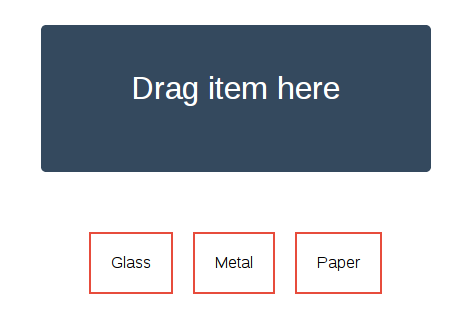

# Drag and Drop



This is an example of implementing drag and drop functionality using React. This
is the first example where we'll use an external library, in this case,
[React DnD][dnd].

[dnd]: https://github.com/gaearon/react-dnd

## Components

This example will have two major components: `Bin`, a component where objects
can be dropped, and `Item`, an item that can be dragged and dropped.

React DND, as you would expect, supports applying different functionality to
different sets of data that is to be dragged and dropped. We declare the
different types of item in the `ItemTypes` object, which is simple since in this
example we only have one type of draggable item:

```js
const ItemTypes = {
    ITEM: 'item'
};
```

Next, we define the `Item` component, and declare it draggable. Because React
DND, like the underlying HTML5 drag-and-drop API, supports dragging *data* as
well as visible objects, we have to decalare what kind of data should be moved
along with the component. The `beginDrag` function does it, and in this case we
only carry the component's name, since it's the only data it has.

```js
var Item = React.createClass({
  mixins: [DragDropMixin],

  statics: {
    configureDragDrop: function(register) {
      register(ItemTypes.ITEM, {
        dragSource: {
          beginDrag: function(component) {
            return {
              item: {
                name: component.props.name
              }
            };
          }
        }
      });
    }
  },

  render: function () {
    return (
      <li className='item'
        {...this.dragSourceFor(ItemTypes.ITEM)}>
        {this.props.name}
      </li>
    );
  }
});
```

Now we define the component we can drop objects into. The `Bin` component has a
list of dropped items in its state, and an `addItem` method which takes the name
of an item to add to that list.

```js
var Bin = React.createClass({
  mixins: [DragDropMixin],

  getInitialState: function() {
    return { items: [] };
  },

  addItem: function(name) {
    clone = this.state.items.slice(0);
    clone.push(name);
    this.setState({ items: clone });
  },
```

Now we register the `dropTarget` function, which calls `addItem` when an object
is dropped into the bin:

```js
  statics: {
    configureDragDrop: function(register) {
      register(ItemTypes.ITEM, {
        dropTarget: {
          acceptDrop: function(component, item) {
            component.addItem(item.name);
          }
        }
      });
    }
  },
```

Here we have the render function. We look at the component's drop state to see whether:

* Nothing is happening.
* A droppable object is being dragged.
* A droppable object hsa been dragged over the component.

We use this to change the component's class name, then later we'll use CSS to
style it.

We also query the component's drop state to determine whether the text on the
bin should read "Release to drop: or "Drag item here".

```js
  render: function() {
    const dropState = this.getDropState(ItemTypes.ITEM);

    var stateClass = 'none';
    if (dropState.isHovering) {
      stateClass = 'hovering';
    } else if (dropState.isDragging) {
      stateClass = 'dragging';
    }

    const dropped = this.state.items.map(function(name) {
      return <li>{name}</li>;
    });

    return (
      <div className={'bin bin-state-' + stateClass}
        {...this.dropTargetFor(ItemTypes.ITEM)}>
        {dropState.isHovering ?
         'Release to drop' :
         'Drag item here'}
        <ul className="dropped">
          {dropped}
        </ul>
      </div>
    );
  }
});
```

Finally, we create a small container object for this example and add some
example items:

```js
var Container = React.createClass({
  render: function() {
    return (
      <div>
        <Bin />
        <ul className='items'>
          <Item name='Glass' />
          <Item name='Banana' />
          <Item name='Paper' />
        </ul>
      </div>
    );
  }
});

React.render(
    <Container />,
    document.body
);
```

## Style

Now it's time to add some CSS.

First, some general style:

```css
body {
    margin: 0;
    padding: 0;
    min-height: 100vh;

    font-family: 'Helvetica Neue', Helvetica, Arial, sans-serif;
}
```

Now we make the bin a big square in the middle:

```css
.bin {
    width: 300px;
    margin: 35px auto;
    padding: 45px;

    color: white;
    font-size: 2em;
    text-align: center;

    border-radius: 5px;
}
```

We used CSS classes to mark up the different states of the bin, so now let's use
those to change the color of the bin to match the state:

```css
.bin-state-none {
    background-color: #34495E;
}

.bin-state-dragging {
    background-color: #E98B39;
}

.bin-state-hovering {
    background-color: #2ECC71;
}
```

Since we show a list of items that have been dropped inside the bin, let's style
that:

```css
.dropped {
    margin: 20px 0;
    padding: 0;
}

.dropped li {
    list-style-type: none;
    font-size: 0.6em;
}
```

And finally, the items that can be dropped:

```css
.items {
    padding: 0;
    text-align: center;
}

.item {
    display: inline-block;
    padding: 20px;
    margin: 25px 10px;

    border: 2px solid #E74C3C;
}
```
