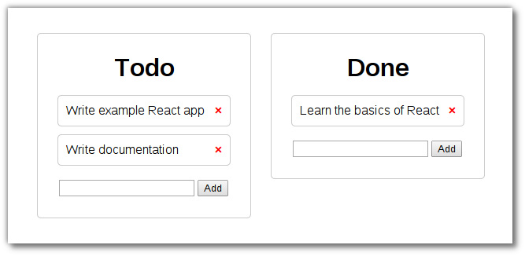

# Kanban



This example is basically a [Trello][trello] clone: We have a set of lists of
tasks ("Todo", "Done"), and each holds some tasks. We can add tasks, delete
them, or drag them from one list to the other. We'll [React DnD][dnd] for
drag-and-drop and a simple Python server for persistence.

## The Server

We'll be using [Flask][flask] for the server, since we don't need much. First,
the imports and the app definition:

```python
import json

from flask import Flask, request
app = Flask(__name__, static_url_path='', static_folder='.')
```

Now, some barebones models:

```python
class Task(object):
    """A task."""

    def __init__(self, text):
        self.text = text

    def to_dict(self):
        return {"text": self.text}


class TaskList(object):
    """A list of Task objects."""

    def __init__(self, name, tasks):
        self.name = name
        self.tasks = tasks

    def to_dict(self):
        return {
            "name": self.name,
            "tasks": [task.to_dict() for task in self.tasks]
        }


class Board(object):
    """A collection of TaskLists."""

    def __init__(self, lists):
        self.lists = lists

    def to_dict(self):
        return {
            "lists": [list.to_dict() for list in self.lists]
        }
```

For persistence, we'll just use the memory:

```python
DB = Board([
    TaskList(name="Todo",
             tasks=[
                 Task("Write example React app"),
                 Task("Write documentation")
             ]),
    TaskList(name="Done",
             tasks=[
                 Task("Learn the basics of React")
             ])
])
```

### Routes

And now, the routes. This is just a simple REST API that uses JSON, handles
actions and even some errors.

First, we need a route that will be called on application startup, to get the
initial (or current) state of the Kanban board:

```python
@app.route("/api/board/")
def get_board():
    """Return the state of the board."""
    return json.dumps(DB.to_dict())
```

We also need a way to add new tasks to a list, which is what `add_task` does.

```python
@app.route("/api/<int:list_id>/task", methods=["PUT"])
def add_task(list_id):
    # Add a task to a list.
    try:
        DB.lists[list_id].tasks.append(Task(text=request.form.get("text")))
    except IndexError:
        return json.dumps({"status": "FAIL"})
    return json.dumps({"status": "OK"})
```

And a way to delete tasks:

```python
@app.route("/api/<int:list_id>/task/<int:task_id>", methods=["DELETE"])
def delete_task(list_id, task_id):
    # Remove a task from a list.
    try:
        del DB.lists[list_id].tasks[task_id]
    except IndexError:
        return json.dumps({"status": "FAIL"})
    return json.dumps({"status": "OK"})
```

Finally, we use the root route to serve the `index.html` file:

```python
@app.route("/")
def index():
    return app.send_static_file('index.html')
```

And now we tell Flask to always run the server on port 8000:

```python
if __name__ == "__main__":
    app.run(port=8000, debug=True)
```

## The Client


[REWRITE]

## Style

And finally, we add some style. First, general `body` style;)

```css
@charset "utf-8";

body {
    margin: 0;
    font-family: "Helvetica Neue", Helvetica, Arial, sans-serif;
}
```

Next, we style the task lists:

```css
.lists {
    padding: 50px;
}

.task-list {
    width: 220px;
    float: left;
    margin-right: 25px;
    padding: 25px;
    border: 1px solid #ccc;
    border-radius: 5px;
}

.list-title {
    margin: 0;
    text-align: center;
}

.list-tasks {
    padding: 0;
}
```

The task list's drop target is just a big rectangle with the text "Drop here",
so that's not very complicated:

```css
.drop {
    width: 100%;
    text-align: center;
    font-weight: bold;
    padding: 15px 0;
}
```

Since we change the class of the drop bin depending on its state, we use this
state to style it. When the state is `none`, we hide it, on the two other
states, we change the color:

```css
.drop-state-none {
    display: none;
}

.drop-state-dragging {
    background-color: #E98B39;
}

.drop-state-hovering {
    background-color: #2ECC71;
}
```

```css
.task {
    list-style-type: none;
    border: 1px solid #ccc;
    border-radius: 5px;
    padding: 10px;
    margin-bottom: 10px;
}

.delete:before {
    content: "×";
}

.delete {
    color: red;
    float: right;
    font-weight: bold;
}
```

[flask]: http://flask.pocoo.org/
[trello]: https://trello.com/
[dnd]: https://github.com/gaearon/react-dnd
